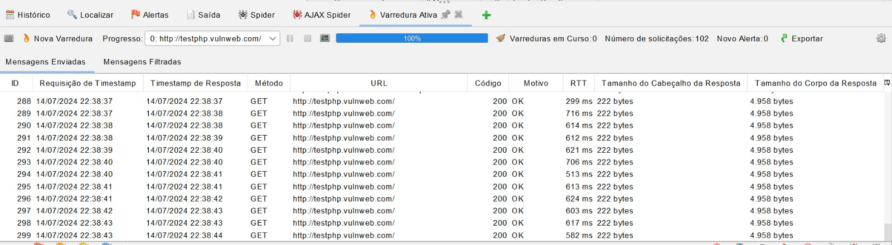
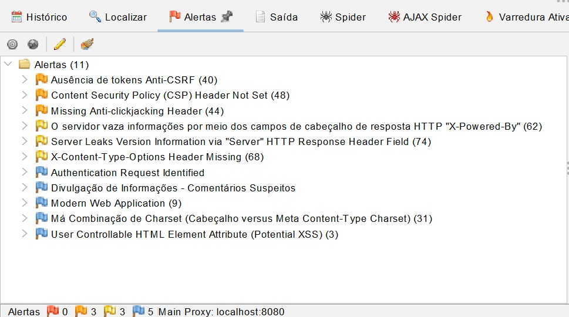

# Por que testar a UI?

Testar a **Interface do Usuário (UI)** é crucial para garantir que o software funcione conforme esperado para os usuários finais. Isso inclui verificar se os elementos visuais estão corretos, se as interações são intuitivas e se a experiência geral do usuário é satisfatória. Testes de UI ajudam a identificar problemas de usabilidade, bugs visuais e garantir a consistência da aplicação.

---

<!-- _backgroundColor: #f5f5f5 -->
<!-- _footer: "Fonte: blog.ebaconline.com.br" -->


---

<!-- _backgroundColor: #ffffff -->
<!-- _color: #333333 -->
<!-- _footer: "Fonte: https://www.selenium.dev/about/" -->

# O que é Selenium e como surgiu?

**Selenium** é uma ferramenta de automação de testes utilizada para testar aplicações web através de interações simuladas com o navegador. Surgiu em 2004 como Selenium Core por Jason Huggins, evoluindo para Selenium WebDriver e Selenium IDE.

---

<!-- _backgroundColor: #ffffff -->
<!-- _color: #333333 -->
<!-- _footer: "Fonte: https://www.selenium.dev/about/" -->

# Por que usar Selenium?

- **Compatibilidade:** Suporta Chrome, Firefox, Safari, etc.
- **Linguagens:** Java, Python, C#, etc.
- **Flexibilidade:** Integração com CI/CD.
- **Automação:** Interage com UI complexa, como AJAX.

---

<!-- _backgroundColor: #f5f5f5 -->
<!-- _footer: "Fonte: blog.ebaconline.com.br" -->

# Python e Selenium: Como trabalham juntos?

```python
from selenium import webdriver
from selenium.webdriver.common.by import By
import time

# WebDriver
driver = webdriver.Firefox()

try:
    # Abre o navegador 
    driver.get('http://the-internet.herokuapp.com/login')
    
    # Encontra o campo de nome de usuário e insere um valor
    username = driver.find_element(By.ID, 'username')
    username.send_keys('tomsmith')
    
    # Encontra o campo de senha e insere um valor
    password = driver.find_element(By.ID, 'password')
    password.send_keys('SuperSecretPassword!')
    
    # Encontrar o botão de login e clicar nele
    login_button = driver.find_element(By.CSS_SELECTOR, 'button.radius')
    login_button.click()
    
    # Aguarda o carregamento da página
    time.sleep(5)
    
    # Verificar se o login foi bem-sucedido
    success_message = driver.find_element(By.CSS_SELECTOR, 'div.flash.success')
    assert 'You logged into a secure area!' in success_message.text
    
    print("Teste de login bem-sucedido!")
    
except Exception as e:
    print(f"Teste falhou: {e}")

finally:
    # Fechar o navegador
    driver.quit()
```
---
<!-- _backgroundColor: #f5f5f5 -->
# Como o código Python funciona com Selenium?

1. No caso do código acima, abre um navegador, como o **Firefox**.
2. Navega para uma página da internet específica, como uma página de **login**.
3. Localiza os campos onde são inseridos o **nome de usuário** e **senha**.
4. Insere automaticamente o nome de usuário e senha nesses campos.
5. Clica no **botão de login** para enviar os dados.
6. Espera um pouco para garantir que a página carregue corretamente.
7. Verifica se uma mensagem como "**Você entrou em uma área segura**" aparece na tela para confirmar o sucesso do login.

---
<!-- _backgroundColor: #f5f5f5 -->
# Selenium como uma IDE

**Selenium IDE** é uma extensão do navegador que **grava e reproduz ações** do usuário. É uma ferramenta de uso simples que grava as ações de um usuário usando comandos Selenium com parâmetros definidos conforme o contexto de cada elemento. Esta é uma excelente forma de aprender toda a **sintaxe Selenium**.

Está disponível para os navegadores **Google Chrome**, **Mozilla Firefox** e **Microsoft Edge**.

---

# Testes de segurança

Os testes de segurança (security testing) são uma prática essencial para garantir a proteção e integridade de dados e de informações em sistemas, aplicativos e redes. Dessa forma, os testes verificam se o programa está funcionando como esperado, identificando e analisando possíveis vulnerabilidades e pontos de falha que possam ser explorados por hackers e criminosos cibernéticos.


<!-- _backgroundColor: #f5f5f5 -->
<!-- _footer: "Fonte: blog.ebaconline.com.br" -->

---

# OWASP ZAP

OWASP ZAP (Zed Attack Proxy) é uma ferramenta de teste de penetração gratuita e de código aberto utilizada para testar a segurança de aplicativos da web. Ela é mantida por The Software Security Project (SSP), uma iniciativa focada em melhorar a segurança de software. É conhecido como um “proxy man-in-the-middle”, interceptando e inspecionando o tráfego entre o navegador e a aplicação, permitindo que os testadores identifiquem e explorem vulnerabilidades.


<!-- _backgroundColor: #f5f5f5 -->
<!-- _footer: "Fonte: blog.ebaconline.com.br" -->

---

# Características do OWASP ZAP

- **Open source** e gratuito.
- **Interface amigável e intuitiva**, adequada para desenvolvedores e profissionais de segurança.
- **Escaneamento passivo** que analisa o tráfego HTTP/HTTPS sem enviar solicitações adicionais ao servidor.
- **Escaneamento ativo:** envolve a interação direta com a aplicação web, enviando várias solicitações adicionais ou modificadas ao servidor para identificar vulnerabilidades.
- **Spider** para descoberta de conteúdo.
- **Relatórios detalhados** de vulnerabilidades


<!-- _backgroundColor: #f5f5f5 -->
<!-- _footer: "Fonte: blog.ebaconline.com.br" -->

---

# Como usar o OWASP ZAP para uma verificação automatizada?
## Exemplo prático

1. **Página inicial:** Inserir a URL do aplicativo web escolhido para sofrer os ataques. 


---

<!-- _backgroundColor: #f5f5f5 -->
<!-- _footer: "Fonte: blog.ebaconline.com.br" -->

2. **Spider:** O ZAP prosseguirá rastreando o aplicativo web com seu spider e escaneando passivamente cada página que encontrar.


---

<!-- _backgroundColor: #f5f5f5 -->
<!-- _footer: "Fonte: blog.ebaconline.com.br" -->

3. **Varreduras ativas:** Então o ZAP usará o scanner ativo para atacar todas as páginas, funcionalidades e parâmetros descobertos.



---

<!-- _backgroundColor: #f5f5f5 -->
<!-- _footer: "Fonte: blog.ebaconline.com.br" -->

4. **Alertas**



---

<!-- _backgroundColor: #f5f5f5 -->
<!-- _footer: "Fonte: blog.ebaconline.com.br" -->

5. **Relatório:**

    - Tipos de alertas com o grau de vulnerabilidade:

    


    - Sessão que contém informações adicionais sobre os alertas com o grau de vulnerabilidade:

    

---

<!-- _backgroundColor: #f5f5f5 -->
<!-- _footer: "Fonte: blog.ebaconline.com.br" -->


# Conclusão

Os testes de segurança são cruciais para proteger aplicações web contra ameaças e vulnerabilidades. O OWASP ZAP oferece uma maneira eficiente e eficaz de realizar esses testes, ajudando a garantir a segurança e a integridade de sistemas web.


<!-- _backgroundColor: #f5f5f5 -->
<!-- _footer: "Fonte: blog.ebaconline.com.br" -->

---
